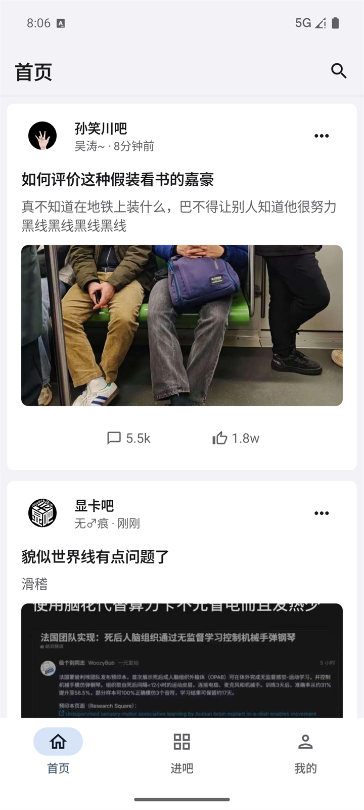
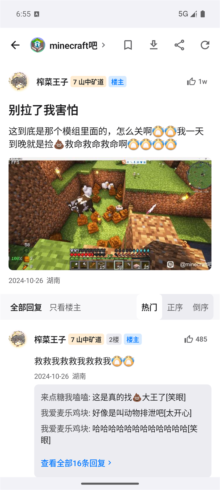
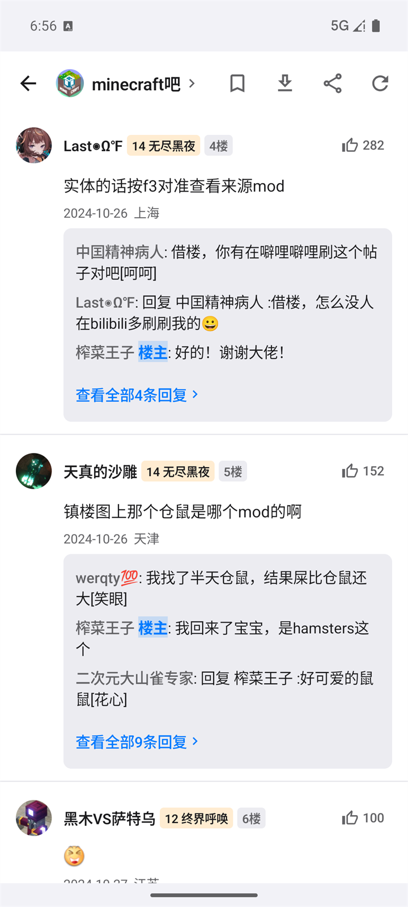
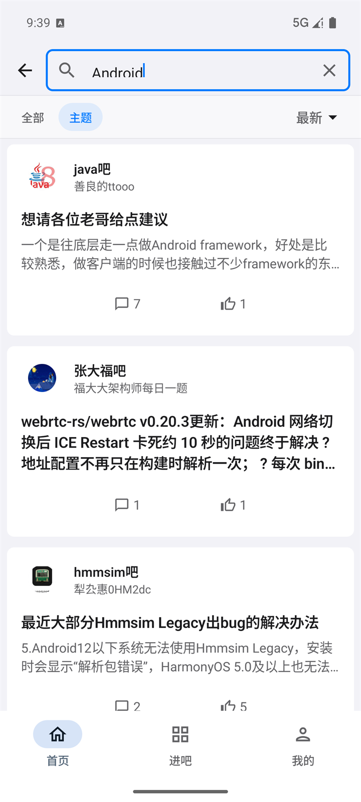
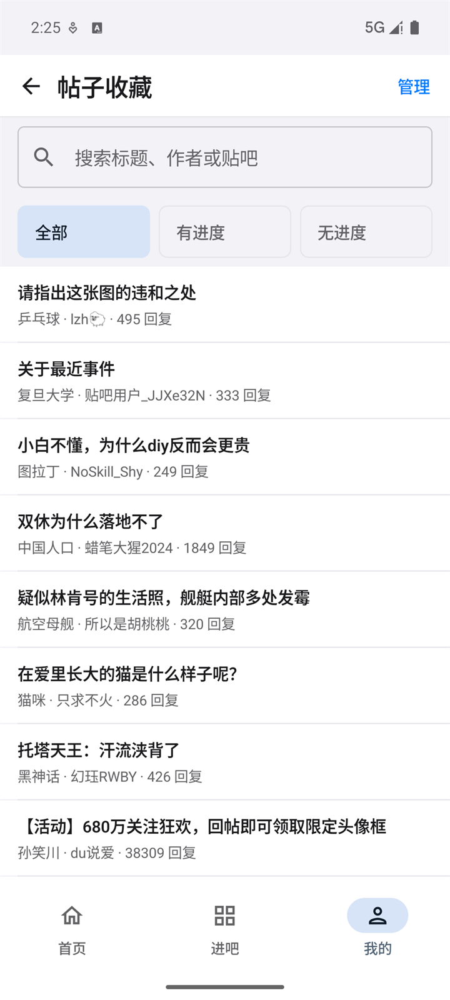
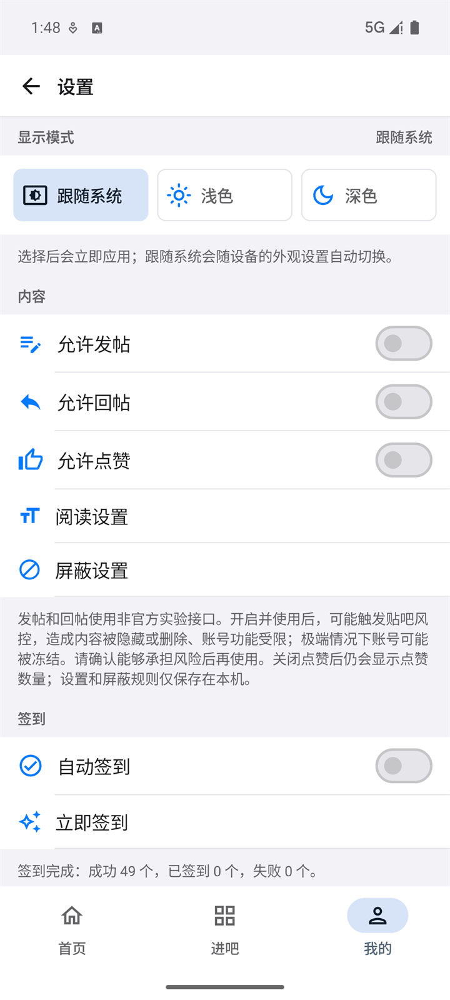

# TiebaPure-Android

[](https://github.com/infinityf4p/TiebaPure-Android/actions/workflows/ci.yml?query=branch%3Amain)
[](LICENSE)
[](https://github.com/infinityf4p/TiebaPure-Android/releases/latest)

基于 Kotlin 与 Jetpack Compose 的第三方百度贴吧客户端。与 [TiebaPure-iOS](https://github.com/infinityf4p/TiebaPure-iOS) 使用同一套最小 Protobuf 协议定义，导航、返回手势、媒体播放、存储和自适应布局遵循 Android 平台惯例。

## 截图

<p align="center">
  
  
  
</p>

<p align="center">
  
  
  
</p>

## 功能

**浏览**（无需登录）

- 首页推荐、进吧、吧内列表，「最新 / 精华」分类，可按回复时间或发帖时间排序
- 搜索主题与回复，吧内搜索
- 帖子详情、楼中楼、官方网页链接分享、图片缩放与保存、视频播放

**登录后**

- 消息：回复我的、@我的
- 关注或取消关注用户、贴吧，查看关注与粉丝列表
- 收藏帖子，收藏保存在贴吧账号里，与官方客户端同步
- 贴吧签到：一键为关注的贴吧签到，也可以设置每天第一次打开时自动签到
- 主贴、楼层、楼中楼点赞
- 发布文字主题，回复帖子、楼层与楼中楼；回复支持图片、贴吧表情和本机草稿
- 编辑本人资料（昵称、简介和性别）

注意！发布、回复和个人资料编辑目前仅为实验性功能，均通过非官方接口完成，可能存在风险，会触发百度官方风控导致删帖等。发帖和回复需要在设置里显式打开。

**本机功能**

- 关键词 / 用户 / 贴吧屏蔽
- 浏览历史支持搜索、筛选和批量管理，上限 500 条；阅读位置自动恢复，上限 500 条
- 帖子本地保存与离线阅读，支持离线媒体、搜索、新回复检查和备份导入导出
- 手机、平板自适应布局，外观可跟随系统或手动选择浅色 / 深色，支持导入 TTF / OTF 阅读字体
- 深链接 `tiebapure://thread/...`、`tiebapure://forum/...`、`tiebapure://search/...`，以及 `https://tieba.baidu.com/p/...`

## 下载

[Releases](https://github.com/infinityf4p/TiebaPure-Android/releases/latest) 提供可直接安装的签名 APK，要求 Android 6.0（API 23）或更高版本。

## 构建

已验证的开发环境为 JDK 17、Android SDK 36 和 Build Tools 36.0.0。

```bash
./gradlew assembleDebug
```

完整的测试、Release 构建、签名与项目结构说明见 [开发文档](docs/DEVELOPMENT.md)。

## 开源许可

TiebaPure-Android 以 [GPL-3.0-only](LICENSE) 发布，不提供任何担保。APK 和 AAB 内含项目 GPL、Apache License 2.0、Protocol Buffers BSD 3-Clause 以及 [第三方声明](THIRD_PARTY_NOTICES.md)。

## 声明

本项目与百度公司、百度贴吧官方无隶属、授权或认可关系。

“百度”“贴吧”及相关名称与标识归其各自权利人所有。

## 感谢

感谢 [TiebaLite](https://github.com/HuanCheng65/TiebaLite) 为项目早期开发提供参考，也感谢 [aiotieba](https://github.com/lumina37/aiotieba) 对贴吧协议的整理与开源实现。

感谢 [LINUX DO](https://linux.do/) 社区的支持。
